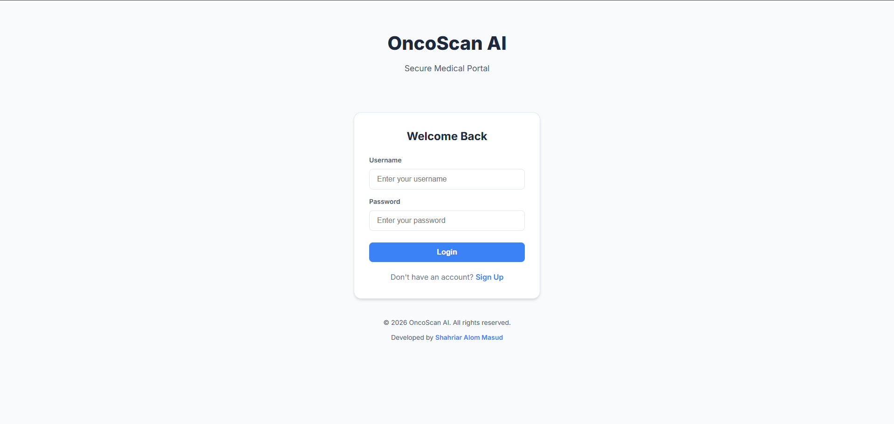
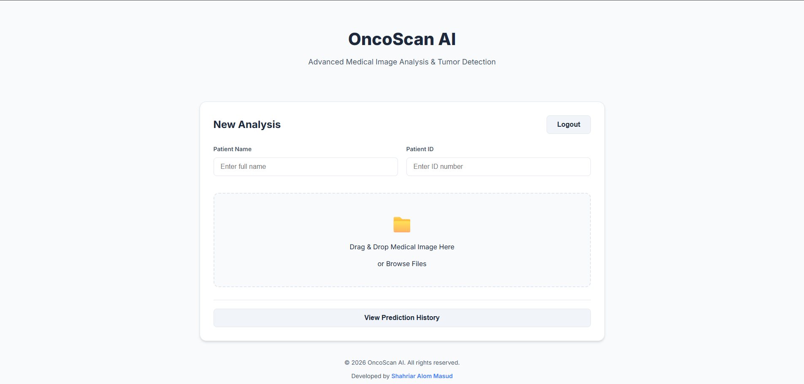
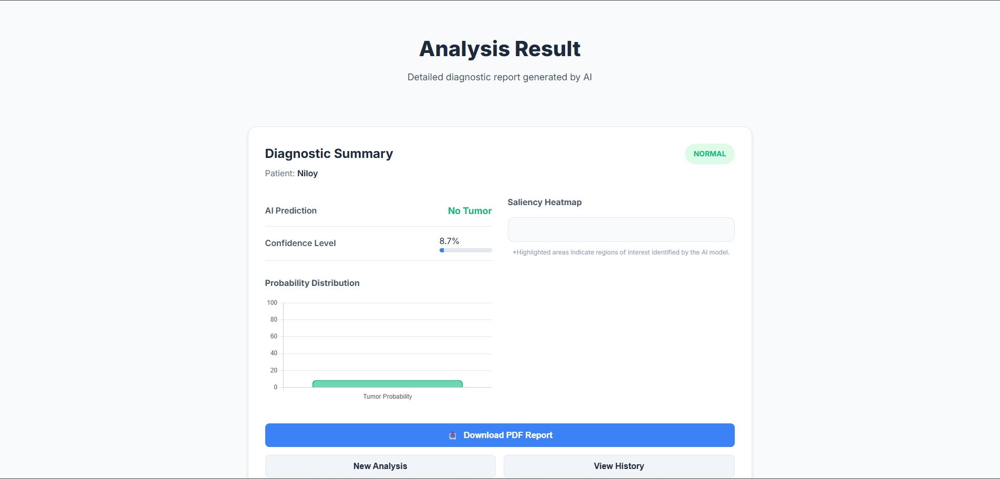
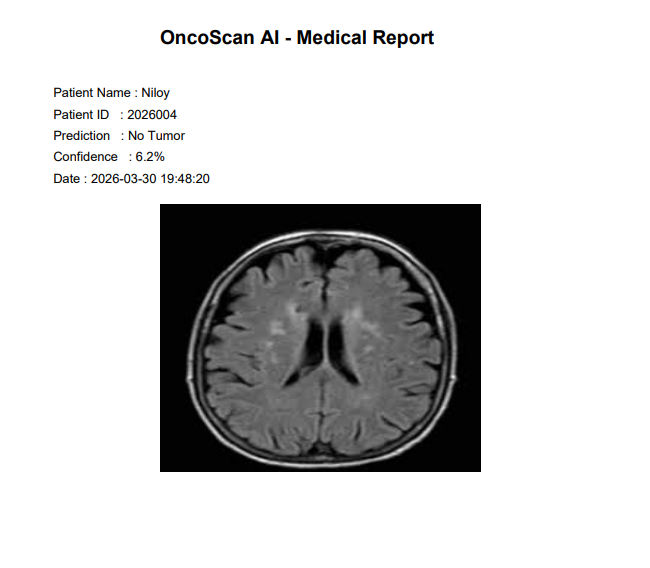
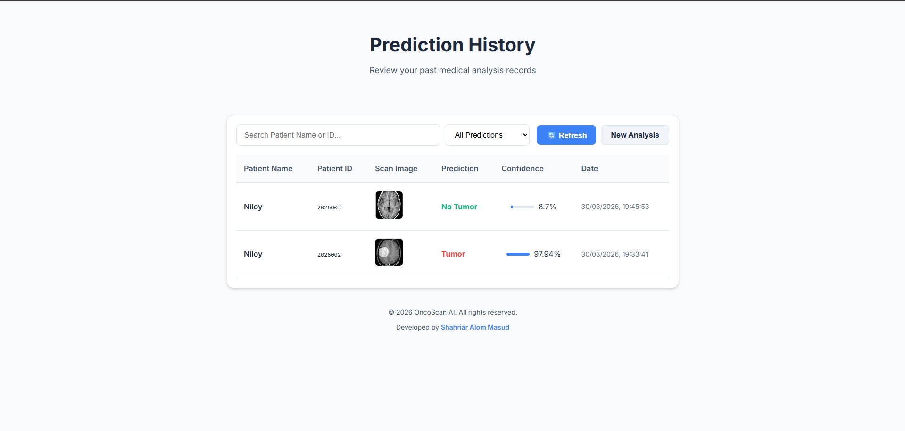
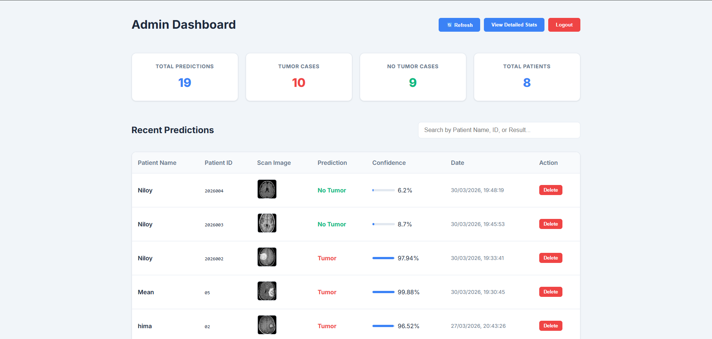
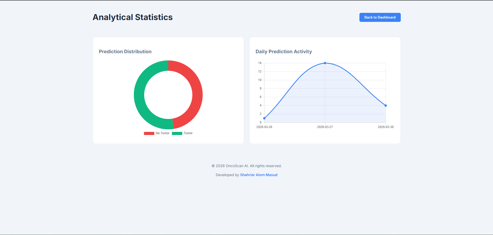

# NeuroScan AI: Full Stack Explainable Brain Tumor Detection System Using CNN and Grad-CAM


---

## Project Overview

NeuroScan AI is a full-stack explainable artificial intelligence system developed for detecting brain tumors from MRI images using a Convolutional Neural Network (CNN). The system integrates Grad-CAM for heatmap-based explainable AI visualization, a FastAPI backend for prediction and data management, and a modern React Single Page Application (SPA) frontend built with Tailwind CSS v3 for user interaction.

The platform includes PDF medical report generation, prediction history tracking, and an admin analytics dashboard. The backend is deployed on Render and serves the compiled React frontend directly — no separate frontend hosting is required. The trained deep learning model is optimized and deployed using ONNX Runtime for efficient inference.

This project integrates Machine Learning, Backend Development, Frontend Development (React + Tailwind CSS), Database Management, REST API Development, and Cloud Deployment into a complete AI-based web platform.

---

## Key Features

- Brain tumor detection from MRI images
- Explainable AI using Grad-CAM heatmaps
- PDF medical report generation
- User authentication system (Login & Register)
- Prediction history tracking
- Admin dashboard with analytics
- Interactive charts and statistics visualization (Chart.js)
- React SPA served directly from FastAPI (single server, single port)
- ONNX optimized model inference
- Full-stack AI web application

---

## Project Motivation

Brain tumor diagnosis using MRI images is a complex and time-consuming process that requires expert radiologists. The goal of this project is to assist medical professionals by developing an AI system that can automatically analyze MRI images and predict whether a tumor is present or not.

The system also provides explainable AI visualization (Grad-CAM heatmap) to show which region of the MRI image influenced the model's decision.

---

## Dataset Source

The brain MRI dataset used for training the model was collected from publicly available medical imaging datasets and brain MRI tumor classification datasets available on Kaggle and other open research sources.

The dataset contains MRI brain images categorized into:

- Tumor
- No Tumor

---

## Project Structure

```
neuroscan-ai/
│
├── backend/                        # FastAPI backend + AI integration
│   ├── main.py                     # Main FastAPI application (API + SPA host)
│   └── database.py                 # Database connection & schema setup
│
├── frontend/                       # React SPA (Vite + Tailwind CSS v3)
│   ├── src/
│   │   ├── pages/
│   │   │   ├── Login.jsx           # Login & Register page
│   │   │   ├── Home.jsx            # MRI upload page
│   │   │   ├── Result.jsx          # Prediction result & PDF download
│   │   │   ├── History.jsx         # User prediction history
│   │   │   ├── AdminDashboard.jsx  # Admin patient records table
│   │   │   └── AdminStats.jsx      # Admin charts & statistics
│   │   ├── App.jsx                 # React Router setup & route guards
│   │   ├── api.js                  # Centralized API base URL config
│   │   ├── main.jsx                # React entry point
│   │   └── index.css               # Tailwind CSS directives
│   ├── dist/                       # Production build (served by FastAPI)
│   ├── tailwind.config.js          # Tailwind CSS v3 configuration
│   ├── vite.config.js              # Vite build configuration
│   └── package.json                # Node.js dependencies
│
├── models/                         # Machine learning models
│   ├── brain_tumor_model.h5
│   ├── model_fixed.h5
│   ├── model_fixed.keras
│   └── model.onnx                  # Optimized ONNX model (used in production)
│
├── Images/                         # README screenshots
│
├── static/                         # Dynamic storage (auto-created)
│   ├── images/                     # Uploaded MRI scan images
│   ├── heatmaps/                   # Grad-CAM heatmap outputs
│   └── reports/                    # Generated PDF medical reports
│
├── fix_model.py                    # Keras model conversion utility
├── database.db                     # SQLite database
├── requirements.txt                # Python dependencies
├── runtime.txt                     # Python runtime version
├── Procfile                        # Deployment startup command
├── .gitignore
└── README.md
```

---

## Application Screenshots

### Login Page

<p align="center">
  
</p>

### Main Upload Page

<p align="center">
  
</p>

### Analysis Result Page

<p align="center">
  
</p>

### Medical PDF Report

<p align="center">
  
</p>

### User Prediction History

<p align="center">
  
</p>

### Admin Dashboard

<p align="center">
  
</p>

### Admin Analytical Statistics

<p align="center">
  
</p>

---

## Machine Learning Model

The brain tumor detection model is built using Deep Learning with Convolutional Neural Networks (CNN).

### Model Details

- Model Type: Convolutional Neural Network (CNN)
- Task: Binary Image Classification
- Classes: Tumor / No Tumor
- Framework: TensorFlow / Keras
- Deployment Model: ONNX Runtime
- Image Processing: OpenCV
- Output:
  - Prediction (Tumor / No Tumor)
  - Confidence Score

---

## Model Input Format

| Parameter     | Value     |
| ------------- | --------- |
| Image Size    | 224 x 224 |
| Channels      | RGB       |
| Normalization | 0–1       |
| Format        | JPG / PNG |
| Batch Size    | 1         |

---

## Grad-CAM Heatmap (Explainable AI)

Grad-CAM (Gradient-weighted Class Activation Mapping) is used to visualize which region of the MRI image influenced the model's prediction.

### Grad-CAM Workflow

Input Image
↓
CNN Forward Pass
↓
Compute Gradients
↓
Generate Heatmap
↓
Overlay Heatmap on Image

This makes the AI system explainable and suitable for medical applications.

---

## Backend (FastAPI)

The backend is developed using FastAPI. All API data routes are prefixed with `/api/`. The backend also serves the compiled React SPA directly — no separate frontend server is needed in production.

### Backend Responsibilities

- User Authentication (Login & Register)
- Image Upload Handling
- AI Model Prediction (ONNX Runtime)
- PDF Report Generation (ReportLab)
- Database Storage (SQLite)
- Prediction History API
- Admin Dashboard APIs
- Statistics and Analytics APIs
- Record Deletion
- Serving the compiled React frontend (catch-all SPA route)

---

## REST API Endpoints

All data endpoints are prefixed with `/api/`.

| Endpoint                    | Method | Description                     |
| --------------------------- | ------ | ------------------------------- |
| /api/register               | POST   | User Registration               |
| /api/login                  | POST   | User Login                      |
| /api/predict                | POST   | Upload image and get prediction |
| /api/history/{user_id}      | GET    | User prediction history         |
| /api/admin/all-history      | GET    | Admin dashboard data            |
| /api/stats                  | GET    | System statistics               |
| /api/stats-details          | GET    | Chart data (daily predictions)  |
| /api/delete/{id}            | DELETE | Delete prediction record        |
| /{any_path}                 | GET    | Serves React SPA (index.html)   |

---

## API Response Example

```json
{
  "prediction": "Tumor",
  "confidence_percent": 97.94,
  "heatmap_url": "/static/images/uuid.jpg",
  "report_url": "/static/reports/report_PT001_abc123.pdf"
}
```

---

## Database (SQLite)

The system uses SQLite to store user accounts and prediction records.

### Users Table

| Field      | Description           |
| ---------- | --------------------- |
| id         | User ID               |
| username   | Username              |
| password   | Password              |
| role       | user / admin          |
| created_at | Account creation date |

### Predictions Table

| Field        | Description        |
| ------------ | ------------------ |
| id           | Prediction ID      |
| user_id      | User ID (FK)       |
| patient_name | Patient Name       |
| patient_id   | Patient ID         |
| image_path   | Uploaded MRI image |
| prediction   | Tumor / No Tumor   |
| confidence   | Confidence score   |
| date         | Prediction date    |

### Relationship

One User → Many Predictions

---

## Frontend (React + Tailwind CSS v3)

The frontend is a modern React Single Page Application (SPA) built with Vite and styled entirely using Tailwind CSS v3. It communicates with the FastAPI backend via the `/api/` REST endpoints.

### Pages / Components

| Component         | Route          | Description                            |
| ----------------- | -------------- | -------------------------------------- |
| Login.jsx         | /login         | Login and Registration form            |
| Home.jsx          | /              | MRI image upload & analysis trigger    |
| Result.jsx        | /result        | AI prediction result & PDF download    |
| History.jsx       | /history       | User's past prediction records         |
| AdminDashboard    | /admin         | Admin table of all patient predictions |
| AdminStats.jsx    | /admin/stats   | Pie chart & daily activity line chart  |

### User Features

- Login & Register
- Drag-and-drop MRI image upload with preview
- AI prediction result with confidence score
- MRI scan/heatmap display
- PDF medical report download
- View personal prediction history

### Admin Features

- All patient prediction records table
- Delete individual prediction records
- Statistics overview (totals, tumor vs no-tumor counts)
- Prediction distribution Pie Chart (Chart.js)
- Daily analysis activity Line Chart (Chart.js)

---

## System Architecture (Single Server)

```
User (Browser)
      |
      v
FastAPI Backend (port 8000)
      |
      ├── /api/* routes → AI Prediction, Auth, History, Stats
      |         |
      |         v
      |     ONNX Runtime → model.onnx → Prediction + PDF
      |         |
      |         v
      |     SQLite Database
      |
      └── /* catch-all → React SPA (dist/index.html)
                |
                v
         React Router (client-side routing)
         └── Login / Home / Result / History / Admin pages
```

---

## ONNX Optimization

The trained TensorFlow/Keras model was converted to ONNX format to improve deployment performance and reduce dependency issues on cloud platforms.

Benefits of ONNX:
- Faster inference
- Lower memory usage
- No TensorFlow dependency on server
- Better deployment compatibility
- Smaller runtime environment

---

## Deployment

| Component       | Platform     |
| --------------- | ------------ |
| Backend + SPA   | Render       |
| Database        | SQLite       |
| AI Model        | ONNX Runtime |
| Version Control | GitHub       |

---

## Run Locally

### Option 1: Single Server (Production Mode)

```bash
git clone https://github.com/competitive7coder/NeuroScan-AI
cd NeuroScan-AI
python -m venv venv
venv\Scripts\activate
pip install -r requirements.txt
uvicorn backend.main:app --reload
```

Open `http://localhost:8000` — FastAPI serves both the API and the React frontend.

### Option 2: Separate Dev Servers (Development Mode)

Run two terminals for live frontend hot-reloading:

**Terminal 1 – Backend:**
```bash
venv\Scripts\activate
uvicorn backend.main:app --reload
```

**Terminal 2 – Frontend:**
```bash
cd frontend
npm install
npm run dev
```

Open `http://localhost:5173` for the React dev server (proxies API calls to port 8000).

---

## Project Workflow

User Login
↓
Upload MRI Image
↓
Image Preprocessing (OpenCV → 224x224, Normalize)
↓
CNN Model Prediction (ONNX Runtime)
↓
Generate PDF Report (ReportLab)
↓
Save Data to SQLite Database
↓
Return Result to React Frontend
↓
Display Prediction + Confidence + Download Report
↓
Admin Dashboard Analytics

---

## Technologies Used

### Machine Learning

- TensorFlow / Keras (training)
- CNN (Convolutional Neural Network)
- Grad-CAM (Explainable AI)
- OpenCV (image preprocessing)
- ONNX Runtime (production inference)
- NumPy

### Backend

- FastAPI
- Python
- SQLite
- ReportLab (PDF generation)
- Uvicorn

### Frontend

- React 18 (SPA)
- Vite (build tool)
- Tailwind CSS v3 (utility-first styling)
- React Router v6 (client-side routing)
- Chart.js + react-chartjs-2 (analytics charts)
- Lucide React (icons)

### Deployment

- Render
- GitHub

---

## Future Improvements

- Password hashing (bcrypt)
- JWT authentication & refresh tokens
- Email notification system
- Multiple image batch prediction
- Cloud image storage (AWS S3 / Cloudinary)
- Model accuracy dashboard
- Docker deployment
- Role-based access control (RBAC)
- Mobile responsive UI improvements

---

If you like this project, give it a star on GitHub! ⭐
